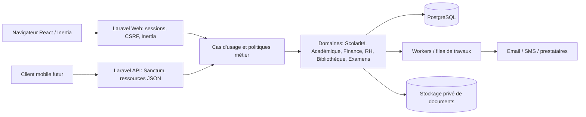
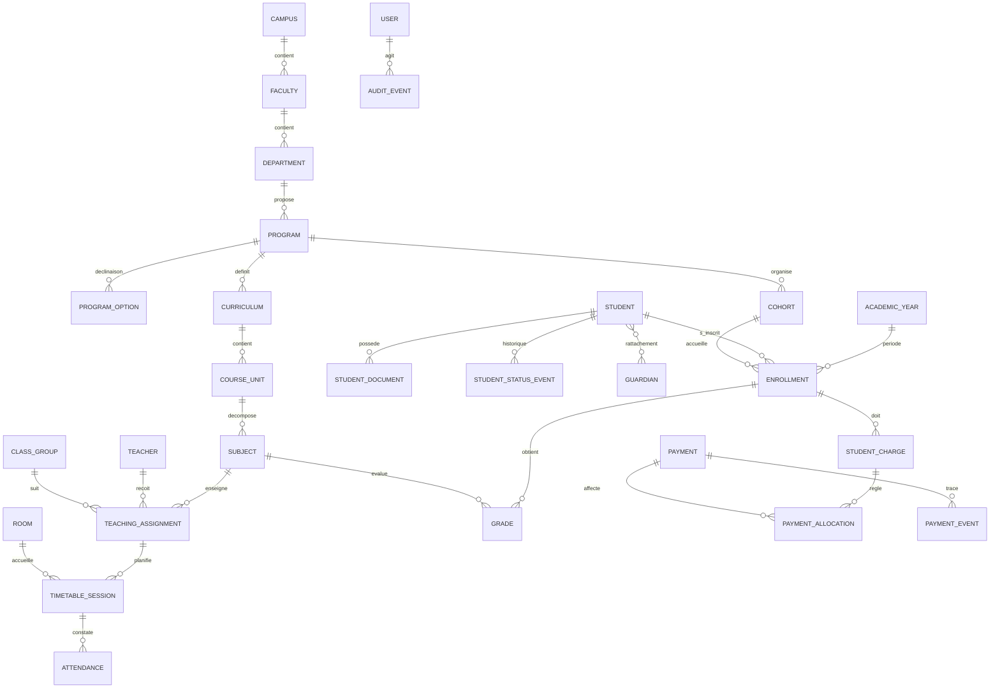
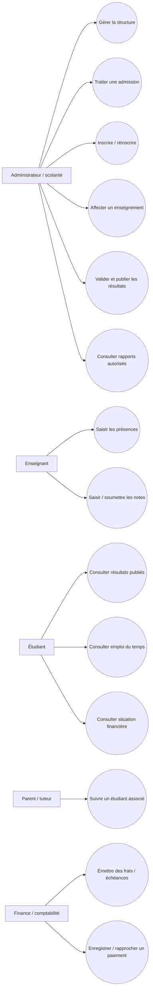
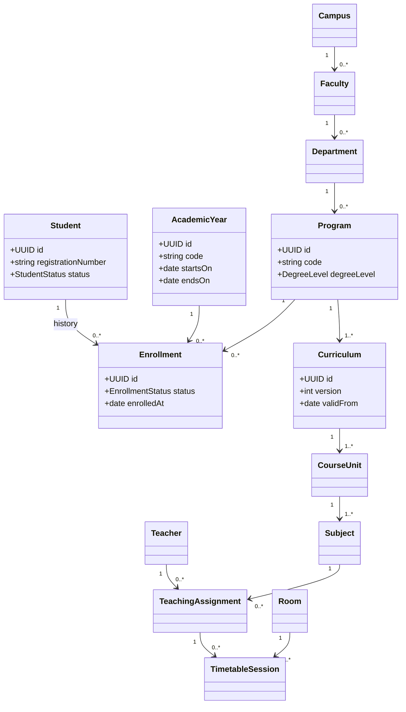
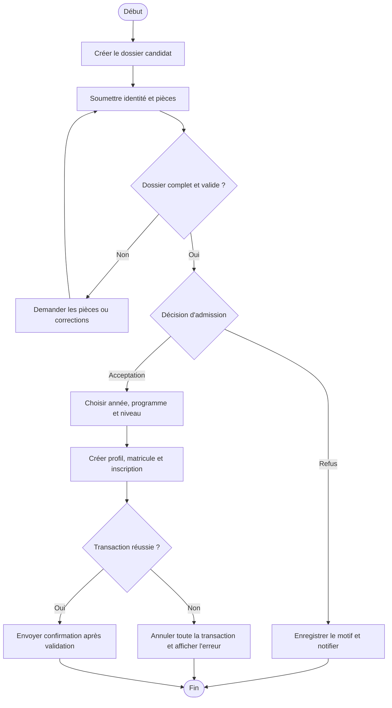
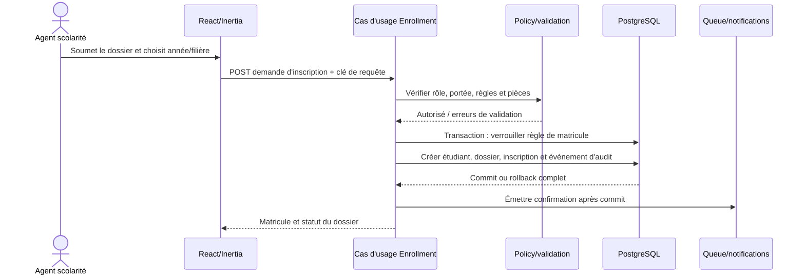
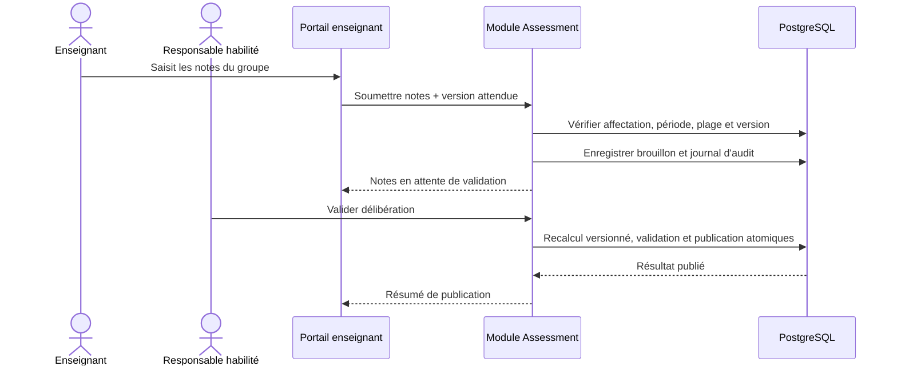

# Cahier des charges et architecture — University ERP

**Version :** 0.1 — cadrage initial  
**Statut :** document de travail, les décisions métier marquées « à confirmer » ne sont pas des exigences validées.  
**Périmètre :** système intégré pour une université privée multi-campus, exploité d’abord sur le Web.

## 1. Résumé exécutif

University ERP doit centraliser les processus académiques, pédagogiques, administratifs, financiers et de communication de l’établissement. Le produit doit garder une source de vérité cohérente, tracer les opérations sensibles, protéger les données personnelles et supporter plusieurs milliers d’étudiants ainsi que plusieurs années universitaires.

La première version doit être construite comme un **monolithe modulaire** Laravel, avec des frontières de domaine explicites. Cette approche garde un déploiement et une exploitation simples au démarrage, tout en séparant les responsabilités assez nettement pour extraire un service plus tard si un besoin mesuré le justifie. Les opérations administratives passent par le Web/Inertia ; l’API REST expose les mêmes cas d’usage à des clients autorisés.

Le dépôt est actuellement un prototype Laravel/Inertia. Il ne constitue pas encore un système de production : les modèles, migrations, contrôleurs et écrans de plusieurs modules ne sont pas alignés, et la couverture fonctionnelle et de sécurité reste partielle. Aucun engagement de production ne doit être déduit de l’existence d’une page ou d’une table.

## 2. Situation du dépôt et décisions techniques

### État observé

- `composer.json` déclare Laravel 12 et PHP `^8.2`, avec Inertia, Sanctum et Ziggy.
- Le client utilise React 18, Inertia React, TypeScript, Tailwind, Lucide et Chart.js.
- PostgreSQL est la base visée, mais les migrations et modèles présents utilisent encore un mélange d’identifiants UUID et entiers.
- Des tables et modèles existent pour les utilisateurs, campus, facultés, départements, programmes, étudiants, inscriptions, années universitaires, UE/ECUE, notes, frais et paiements.
- Une partie des écrans d’administration est amorcée. Les portails étudiant, enseignant et parent, ainsi que plusieurs processus métier, sont à construire.
- Le contrôle par rôle récemment amorcé ne remplace pas des permissions métier fines, des politiques d’accès, une journalisation d’audit ni une revue de sécurité.

### Recommandation de cible

1. **Backend : Laravel 13 et PHP 8.3 au minimum**, uniquement après inventaire de l’environnement local et des dépendances, puis mise à niveau contrôlée. La cible officielle Laravel 13 requiert PHP 8.3 ; le dépôt actuel ne satisfait donc pas encore cette cible. Voir [les notes de version Laravel](https://laravel.com/docs/13.x/releases).
2. **Web : React, Inertia, TypeScript et Tailwind**, en gardant une application Web intégrée au backend tant qu’un client indépendant ne justifie pas un frontend séparé.
3. **API : Sanctum pour l’authentification de l’application propriétaire et les jetons d’API simples.** Évaluer Passport/OAuth uniquement si des clients tiers doivent déléguer l’autorisation selon le protocole OAuth2. Laravel décrit Sanctum comme le choix adapté aux applications combinant UI propriétaire, SPA et API : [documentation Authentication Laravel 13](https://laravel.com/docs/13.x/authentication).
4. **Données : PostgreSQL**, avec une stratégie d’identifiants et des contraintes définies avant d’ajouter d’autres modules. La proposition cible ci-dessous utilise UUID de façon cohérente pour les entités métier.
5. **Architecture : monolithe modulaire**, files de travaux pour traitements longs, stockage objet privé pour les pièces, cache et supervision ajoutés selon les besoins validés.

**Point de migration observé :** le solveur Composer bloque Laravel 13 tant que `laravel/tinker ^2.10` reste une dépendance, car les versions résolues de Tinker n’acceptent pas `illuminate/support` 13. Une résolution à blanc réussit après son retrait. L’installation réelle n’a pas pu être terminée dans cet environnement, car les téléchargements Packagist sont restés bloqués ; le dépôt reste donc sur Laravel 12 et son `composer.lock` cohérent. Tinker est un outil de console de développement, pas un composant nécessaire au fonctionnement métier. Reprendre l’upgrade lorsque le réseau Composer est disponible et valider le remplacement ou le retrait de Tinker.

JWT n’est pas un objectif à lui seul : un jeton de session Web ou un jeton Sanctum est préférable pour les clients propriétaires. MFA est à activer d’abord pour les comptes privilégiés. OAuth relève d’un besoin d’interopérabilité, pas d’un prérequis général.

## 3. Objectifs, utilisateurs et règles de périmètre

### Objectifs produit

- Réduire les doubles saisies et automatiser les tâches administratives répétitives.
- Relier les dossiers étudiants, les inscriptions, les cours, les notes et les paiements autour d’identifiants stables.
- Fournir à chaque profil seulement les données et actions dont il a besoin.
- Conserver l’historique des décisions qui modifient un dossier ou un résultat publié.
- Produire des tableaux de bord, documents et exports à partir de données maîtrisées.
- Être utilisable sur ordinateur, tablette et téléphone ; rester exploitable avec des volumes de plusieurs milliers d’étudiants.

### Profils principaux

| Profil | Responsabilités principales |
|---|---|
| Administrateur système | Paramètres, comptes, rôles, permissions, sécurité, sauvegardes et audit technique. |
| Direction / Scolarité | Structure, admissions, inscriptions, dossiers et décisions académiques. |
| Responsable de faculté / département | Programmes, affectations, groupes, validations et rapports dans son périmètre. |
| Enseignant | Enseignements qui lui sont affectés, présence, notes et supports autorisés. |
| Finance / Comptabilité | Tarifs, échéanciers, paiements, rapprochement et écritures selon délégation. |
| Bibliothécaire | Catalogue, exemplaires, prêts, retours, réservations et pénalités. |
| Étudiant | Son dossier, ses résultats publiés, son emploi du temps, ses paiements et ses documents. |
| Parent / tuteur | Suivi des étudiants associés, selon consentement et périmètre autorisé. |
| RH / Personnel | Dossiers RH, contrats, congés et présences dans son périmètre. |
| Auditeur | Consultation restreinte des journaux et rapports, sans altération des données métier. |

Les rôles sont des regroupements pratiques de permissions. Les autorisations effectives doivent également tenir compte du campus, de la faculté, du département, de l’étudiant concerné et de l’état du processus.

### Principes de périmètre

- Une **inscription** est un événement lié à un étudiant, une année universitaire, une filière et un niveau ; elle ne doit pas être confondue avec le profil permanent de l’étudiant.
- Les frais dus, les paiements reçus et les écritures comptables sont des concepts distincts. Un paiement confirmé ne doit pas être effacé ; une correction passe par annulation/remboursement tracé.
- Une note brouillon, une note validée et un résultat publié ont des états et des droits différents.
- Les changements de filière, transfert, suspension, abandon et exclusion produisent un historique daté avec auteur et motif.
- Les suppressions en cascade ne doivent pas effacer silencieusement les dossiers académiques, les paiements, les pièces ou les journaux. Préférer archivage/désactivation et règles explicites de conservation.

## 4. Exigences fonctionnelles

Chaque exigence ci-dessous doit être transformée en critères d’acceptation et cas de test dans le module correspondant avant son développement.

### 4.1 Structure universitaire

- Gérer les informations de l’établissement, ses campus, facultés, départements, filières, options, promotions, groupes/classes, salles, amphithéâtres et laboratoires.
- Affecter chaque entité à son parent logique et contrôler l’unicité des codes dans le périmètre retenu.
- Définir les périodes d’activité et empêcher la suppression si des données historiques y sont liées.
- Filtrer la structure selon le campus et les responsabilités de l’utilisateur.

### 4.2 Admissions et étudiants

- Gérer préinscription, admission, inscription initiale et réinscription annuelle avec statuts, pièces requises, validation et motifs de refus.
- Générer un matricule non réutilisable et sûr en concurrence ; sa règle doit être configurable par établissement/année si nécessaire.
- Gérer identité, date et lieu de naissance, sexe, nationalité, adresses, téléphones, emails, photo, tuteurs/parents, professions déclarées et contacts d’urgence.
- Stocker les documents privés avec type, propriétaire, date, statut de vérification, visibilité et politique de rétention.
- Conserver historique scolaire, changements de parcours, transferts, suspensions, abandons, exclusions et diplômes.
- Permettre la recherche et les filtres combinables (campus, faculté, département, filière, promotion, année, statut), avec pagination serveur.
- Lier un compte de portail à une personne sans utiliser l’email comme identifiant métier unique de l’étudiant.
- À la validation de l’inscription, créer le compte de portail avec un mot de passe temporaire aléatoire ; remettre ce secret une seule fois à l’agent habilité pour transmission sécurisée et imposer son remplacement avant l’accès au portail.

### 4.3 Enseignants, personnel et RH

- Gérer profil, recrutement, diplômes, CV, spécialités, disponibilité, contrats et documents.
- Affecter les enseignants à des enseignements et conserver les périodes, volumes horaires et validations.
- Gérer les agents administratifs, services, fonctions, contrats, rémunération, congés et présences avec accès RH strictement limité.
- Éviter de mélanger données confidentielles RH et données de portail courantes.

### 4.4 Académique et pédagogie

- Gérer années universitaires, semestres, sessions et calendrier de périodes.
- Définir les programmes, maquettes, UE, ECUE, crédits, coefficients et prérequis, avec versionnement par période d’application.
- Associer cours, supports, vidéos, exercices, travaux pratiques et ressources numériques à des groupes autorisés.
- Maintenir une distinction entre catalogue pédagogique et enseignements réellement affectés.

### 4.5 Emplois du temps, salles et présence

- Planifier cours, examens et soutenances avec groupe, enseignant, salle, début/fin et période.
- Détecter les chevauchements de salle, enseignant et groupe avant confirmation, y compris lors de créations concurrentes.
- Enregistrer les présences d’étudiants, enseignants et personnel avec auteur, source, date et correction tracée.
- QR code et badge peuvent être ajoutés après validation de la procédure et du matériel ; la biométrie reste optionnelle et soumise à une analyse juridique et de protection des données.

### 4.6 Notes et résultats

- Configurer les catégories d’évaluation et leurs poids dans les limites du règlement pédagogique.
- Contrôler la plage de notes, les permissions de saisie et la date limite.
- Calculer moyenne, validation de crédits, mention et classement selon des règles versionnées et validées par la direction académique.
- Mettre en place validation, délibération, publication, rectification motivée et historique des versions.
- Générer bulletins, relevés, attestations et procès-verbaux PDF à partir d’un résultat publié.

### 4.7 Finance et comptabilité

- Définir frais, tarifs, échéanciers, remises, bourses, pénalités et exonérations avec dates d’effet.
- Enregistrer espèces, mobile money, carte et virement ; associer référence externe/idempotency key, statut, auteur et justificatif.
- Réconcilier un paiement fournisseur avec une transaction confirmée ; gérer rejets, annulations et remboursements sans supprimer l’historique.
- Produire reçus numérotés et états par étudiant, période, caisse, méthode et statut.
- Séparer le sous-livre de scolarité de la comptabilité générale en partie double : journaux, comptes, écritures équilibrées, grand livre, balance, budgets et rapports.
- Les montants sont enregistrés en `NUMERIC`, jamais en flottant. La devise et les règles d’arrondi sont explicites.

### 4.8 Bibliothèque, stages, mémoires et communication

- Bibliothèque : catalogue bibliographique, exemplaires, prêts, retours, réservations, pénalités et ressources numériques.
- Stages : entreprises, conventions, encadreurs, suivi, évaluations et rapports.
- Mémoires : sujets proposés, validation, encadrement, jalons, soutenance et archivage.
- Communication : annonces ciblées, emails, SMS, notifications push et messagerie ; conserver consentement, statut d’envoi et préférences.

### 4.9 Portails et tableaux de bord

- Étudiant : notes publiées, emploi du temps, paiements, documents et demandes/attestations.
- Enseignant : planning, listes de groupes, présence, saisie/validation des notes autorisées et supports.
- Parent : étudiants explicitement associés, paiements, résultats publiés, absences et messages autorisés.
- Tableau de bord : métriques filtrées selon rôle/périmètre ; indicateurs calculés de manière cohérente et mis à jour suivant une fréquence définie.
- Les exports PDF, Excel, Word et CSV doivent être autorisés, tracés, paginés/traités en arrière-plan si lourds et protégés contre les formules CSV dangereuses.

### 4.10 Administration, IA et mode hors connexion

- Administrer les comptes, rôles, permissions, paramètres, journaux d’audit, sauvegardes et restaurations.
- IA : uniquement après cadrage d’usage, qualité des données, explicabilité, minimisation des données et validation humaine. La prédiction d’abandon ne doit pas prendre seule une décision défavorable.
- Hors connexion : définir précisément les écrans, données mises en cache, durée, chiffrement local, conflits de synchronisation et révocation. Ce n’est pas une propriété générale de l’application Web.

## 5. Exigences non fonctionnelles proposées

Les valeurs suivantes sont des objectifs de cadrage à confirmer par l’université et l’exploitation ; elles ne sont pas des garanties avant essais de charge.

| Domaine | Objectif initial à valider |
|---|---|
| Capacité | Plusieurs milliers d’étudiants, données multi-annuelles, pagination et index adaptés. |
| Concurrence | Scénario de référence proposé : 100 sessions actives simultanées ; établir le pic réel. |
| Performance | P95 inférieur à 500 ms pour les lectures métier ordinaires hors rapports lourds ; rapports longs en tâche de fond. |
| Disponibilité | Cible initiale 99,5 % mensuelle, hors maintenance annoncée. |
| Reprise | Propositions initiales : RPO 24 h et RTO 4 h ; à confirmer selon budget et hébergeur. |
| Accessibilité | Navigation clavier, libellés de formulaires, contrastes et états d’erreur compréhensibles. |
| Compatibilité | Navigateurs modernes sur ordinateur et téléphone ; politique de versions à définir. |
| Traçabilité | Journaliser acteur, action, cible, date UTC, résultat et identifiant de corrélation pour les opérations sensibles. |
| Localisation | Interface française initiale ; devise, format de date, langue additionnelle et fuseau définis dans la configuration institutionnelle. |

## 6. Architecture logicielle proposée

### 6.1 Vue logique



### 6.2 Modules Laravel

Chaque module possède ses cas d’usage, requêtes, politiques, validations, événements et ressources de sortie. Éviter les contrôleurs « fourre-tout » et les règles métier concentrées dans les composants React.

```text
app/
  Modules/
    IdentityAccess/
    Institution/
    Admissions/
    Students/
    Academic/
    Teaching/
    Scheduling/
    Attendance/
    Assessment/
    Finance/
    Accounting/
    HumanResources/
    Library/
    Internships/
    Theses/
    Communication/
    Reporting/
  Shared/
    Audit/
    Files/
    Notifications/
```

Ce découpage est une cible logique ; il n’est pas nécessaire de déplacer tous les fichiers existants avant d’avoir des tests et une stratégie de migration contrôlée.

### 6.3 Sécurité et identité

- Sessions Laravel pour le Web avec cookies sécurisés, HTTPS, protection CSRF et limitation des tentatives de connexion.
- Sanctum pour l’API propriétaire et les jetons simples ; scopes/abilities plus policies, expiration, révocation et rotation contrôlée.
- MFA pour administrateurs et finance ; récupération de compte sécurisée ; vérification d’email selon le processus retenu.
- Rôles/permissions avec contrôle sur l’action ET le périmètre de données. Un simple champ `role` ne suffit pas.
- Policies Laravel et validation serveur pour chaque lecture/écriture ; ne pas faire confiance à un ID envoyé par le client.
- Pièces hors répertoire public, contrôle de type réel, taille, antivirus si disponible, URL temporaires, droits de téléchargement et rétention.
- Audit immuable des modifications sensibles ; ne pas y placer des mots de passe, jetons ou données inutiles.
- Secrets hors dépôt, TLS, chiffrement des sauvegardes, gestion de clés et procédure d’incident.
- Vérifier OWASP ASVS/Top 10, sécurité des dépendances, CORS, CSP, XSS, injections, SSRF, téléversements et contrôle d’accès.

## 7. Modèle de données proposé

### 7.1 Convention physique cible

- UUID pour toutes les clés primaires métier et toutes les clés étrangères correspondantes ; génération par l’application ou mécanisme PostgreSQL maîtrisé.
- `created_at` / `updated_at` conservés en UTC ; dates de naissance en `DATE`, périodes en `TIMESTAMPTZ` quand une heure est nécessaire.
- `NUMERIC(p,s)` pour montants et notes ; pas de type flottant pour valeurs financières.
- Codes et états normalisés, contraintes `UNIQUE`, `CHECK`, FK et règles `ON DELETE` définies par domaine.
- Suppression logique uniquement quand elle a un sens métier. Les paiements, notes publiées et pièces officielles sont historiques et ne sont pas supprimés en cascade.
- Index sur FK, recherches usuelles, statuts et dates ; index composites guidés par les requêtes réellement utilisées.
- Tables transactionnelles volumineuses (présences, journaux, événements) conçues pour archivage/partitionnement seulement si mesures et rétention le justifient.

Les migrations historiques mélangent UUID et IDs entiers ; cette cible requiert un plan de migration/ reprise, pas une conversion improvisée des données existantes.

### 7.2 MCD — entités et associations



### 7.3 MLD — tables relationnelles de premier périmètre

Les noms sont des propositions à stabiliser avant d’écrire les migrations métier définitives.

**Institution :** `institutions(id, code, legal_name, display_name, timezone, default_currency, settings_json)` ; `campuses(id, institution_id, code, name, address_id, active)` ; `faculties(id, campus_id, code, name, active)` ; `departments(id, faculty_id, code, name, active)` ; `programs(id, department_id, code, name, degree_level, duration_years, active)` ; `program_options(id, program_id, code, name)` ; `academic_years(id, institution_id, code, label, starts_on, ends_on, status)` ; `semesters(id, academic_year_id, code, starts_on, ends_on)` ; `cohorts(id, program_id, academic_year_id, code, level)` ; `class_groups(id, cohort_id, code, capacity)` ; `rooms(id, campus_id, code, name, room_type, capacity)`.

**Identité et scolarité :** `users(id, name, email, password_hash, email_verified_at, is_active)` ; `roles`, `permissions`, `role_user`, `permission_role`, `user_scope_assignments` ; `students(id, user_id nullable, registration_number, legal_identity_fields..., status)` ; `guardians(id, user_id nullable, identity/contact fields)` ; `student_guardians(student_id, guardian_id, relationship, is_primary, can_view_records)` ; `admissions(id, applicant fields, submitted_at, decision, decided_by)` ; `enrollments(id, student_id, academic_year_id, program_id, option_id nullable, cohort_id, status, enrolled_at)` ; `student_documents(id, student_id, document_type, storage_key, checksum, verification_status, verified_by)` ; `student_status_events(id, student_id, from_status, to_status, reason, effective_at, actor_id)` ; `academic_history_items(id, student_id, institution_name, program_name, start_year, end_year, outcome)`.

**Enseignement et évaluation :** `teachers(id, user_id, employee_number, profile_fields...)` ; `teacher_qualifications`, `teacher_specialties`, `teacher_contracts` ; `curricula(id, program_id, version, valid_from, valid_to, status)` ; `course_units(id, code, name, credits)` ; `subjects(id, course_unit_id, code, name, coefficient, hours)` ; `curriculum_subjects(curriculum_id, subject_id, semester_id, required)` ; `teaching_assignments(id, teacher_id, subject_id, class_group_id, starts_on, ends_on)` ; `timetable_sessions(id, teaching_assignment_id, room_id, starts_at, ends_at, session_type, status)` ; `assessment_components(id, teaching_assignment_id, name, weight, max_score, assessment_type)` ; `grades(id, enrollment_id, assessment_component_id, score, status, entered_by, validated_by, published_at)` ; `grade_publication_events` ; `attendance_records(id, timetable_session_id, enrollment_id, status, recorded_by, recorded_at)`.

**Finance et comptabilité :** `fee_types`, `fee_schedules`, `student_charges`, `scholarships`, `discounts`, `payment_intents`, `payments`, `payment_events`, `payment_allocations`, `refunds` ; `chart_of_accounts`, `accounting_periods`, `journal_entries`, `journal_lines`, `bank_reconciliations`. Une écriture validée doit équilibrer débits et crédits.

**Autres domaines :** RH (`employees`, `departments/services`, `contracts`, `leave_requests`, `staff_attendance`) ; bibliothèque (`bibliographic_records`, `book_copies`, `loans`, `reservations`, `library_fines`) ; stages (`companies`, `internships`, `internship_supervisors`, `internship_reviews`) ; mémoires (`thesis_proposals`, `thesis_supervisions`, `defense_sessions`, `thesis_documents`) ; communication (`announcements`, `message_deliveries`, `notification_preferences`) ; transversal (`audit_events`, `stored_files`, `outbox_events`).

### 7.4 MPD — contraintes et index de référence

- Toutes les tables métier utilisent UUID cohérents ; chaque FK doit cibler le même type exact.
- Unicités proposées : `students.registration_number`; `(institution_id, academic_years.code)` ; `(department_id, programs.code)` ; `(program_id, cohorts.academic_year_id, cohorts.level, cohorts.code)` ; `(academic_year_id, student_id)` pour l’inscription unique par année, sauf règle de réinscription définie autrement.
- Les notes valides satisfont `score >= 0 AND score <= max_score`; poids d’évaluations et crédits respectent des plages validées.
- Les sessions satisfont `ends_at > starts_at`. Les conflits de salle/enseignant/groupe doivent être empêchés en transaction ; PostgreSQL peut fournir des contraintes d’exclusion sur plages temporelles après choix du modèle.
- Index usuels : `students(last_name, first_name)`, `students(email)`, `enrollments(academic_year_id, status)`, `grades(enrollment_id, subject_id)`, `payments(status, paid_at)`, `timetable_sessions(room_id, starts_at, ends_at)`.
- Les recherches insensibles à la casse, pagination et filtres doivent être étudiés sur PostgreSQL réel ; ne pas charger toute la table en mémoire.
- La table de paiements conserve montant, devise, méthode, référence fournisseur unique, idempotency key, état et horodatages ; les secrets de paiement ne sont jamais stockés.

## 8. Diagrammes de cas d’utilisation et séquences

### 8.1 Cas d’utilisation principaux



### 8.2 Diagramme de classes métier initial

Ce diagramme exprime les principales associations ; il ne remplace pas les attributs détaillés des tables ci-dessus.



### 8.3 Activité — admission et inscription



### 8.4 Séquence — inscription d’un étudiant



### 8.5 Séquence — saisie et publication d’une note



## 9. Plan de développement

Les phases sont ordonnées par dépendances. Une phase ne passe en production qu’après critères d’acceptation, migration vérifiée, contrôles d’accès, documentation et tests automatisés.

| Phase | Livrables | Critère de sortie |
|---|---|---|
| 0. Cadrage | Règles métier, processus, matrice des rôles, décisions de données, maquettes et scénarios d’acceptation. | Validation des responsables scolarité, pédagogie, finance et direction. |
| 1. Fondation | Mise à niveau PHP/Laravel décidée, PostgreSQL, conventions UUID, architecture modulaire, CI, environnements, journalisation, politiques, sauvegarde. | Installation reproductible et pipeline automatisé ; migrations testées sur base neuve et données d’essai. |
| 2. Institution + identité | Campus, facultés, départements, programmes/options, années, utilisateurs, rôles, permissions, audit. | Accès contrôlés par rôle et périmètre ; changements traçables. |
| 3. Admission + étudiants | Candidature, pièces, décision, inscription/réinscription, matricule, historique, recherche, portail étudiant initial. | Parcours d’inscription complet et dossier consultable sans incohérence. |
| 4. Académique + pédagogie | Semestres, maquettes, UE/ECUE, groupes, cours, enseignants et affectations. | Un étudiant inscrit peut être rattaché à un parcours versionné et à des enseignements. |
| 5. Planning + présence | Salles, emplois du temps, examens, contrôle de conflits, présence. | Les conflits bloquants sont reproduits et rejetés en concurrence. |
| 6. Notes + résultats | Évaluations, workflow, délibération, publication, bulletins et attestations. | Calculs vérifiés par jeux d’exemples approuvés par pédagogie. |
| 7. Frais + paiements | Tarifs, échéanciers, paiements, reçus, rapprochement, bourses/remises. | Idempotence, audit, annulations et rapprochement validés avec finance. |
| 8. Comptabilité + RH | Grand livre en partie double, rapports, personnel, contrats, congés, paie si périmètre confirmé. | Validation comptable et RH ; séparation des rôles et périodes clôturées. |
| 9. Bibliothèque + stages + mémoires | Modules métier dédiés, documents et workflows. | Processus validés par responsables concernés. |
| 10. Communication + reporting | Notifications, annonces, exports, tableaux de bord selon permissions. | Consentements, volumes, échecs et traçabilité opérés. |
| 11. Durcissement + exploitation | Test charge/sécurité, restauration, supervision, runbooks, formation et déploiement progressif. | Exercices de reprise réussis, incidents documentés, critères de mise en service signés. |
| 12. Extensions | Hors ligne, biométrie, IA, mobile natif, intégrations externes selon étude. | Cas d’usage, consentement, risque et valeur mesurable approuvés. |

## 10. Stratégie de qualité, sécurité et livraison

### Tests requis par module

- Unitaires : calculs, règles de validation, matricules, droits et transitions de statut.
- Intégration : transactions PostgreSQL, contraintes FK/unique, concurrence, fichiers, files d’attente et prestataires simulés.
- Fonctionnels : parcours scolarité, enseignant, finance et portail sur navigateur, y compris cas interdits.
- Sécurité : tests d’accès horizontal/vertical, CSRF, XSS, injections, brute force, téléversements, sessions, secrets et exports.
- Régression : erreurs métier corrigées et contrats API versionnés.
- Charge : volumétrie réaliste, utilisateurs simultanés, exports, recherche et clôture de périodes.

Les tests sont à écrire au fil des modules ; une page ne se considère pas terminée parce qu’elle s’affiche.

### Livraison et exploitation

- Environnements séparés (local, intégration, préproduction, production) et données anonymisées hors production.
- CI : formatage/lint, analyse statique PHP/TypeScript, tests, scan dépendances, build frontend et vérification des migrations.
- Déploiement reproductible, migrations compatibles avec déploiement progressif, procédure de retour arrière documentée.
- HTTPS, secrets de production, stockage privé, workers supervisés, planificateur Laravel, journaux centralisés et métriques.
- Sauvegardes automatiques chiffrées et test périodique de restauration ; sauvegarde seule sans exercice de restauration n’est pas suffisante.
- Runbooks d’incident, contacts responsables, rotation des secrets, gestion des vulnérabilités et politique de conservation.
- Guide utilisateur par profil, guide d’administration, dictionnaire des données, documentation API et historique des décisions.

## 11. Décisions à faire valider avant le schéma métier définitif

1. L’université est-elle une seule entité légale avec plusieurs campus, ou plusieurs institutions dans une même installation ?
2. Quelle devise est utilisée pour chaque campus, et quelles règles de conversion/arrondi s’appliquent ? Le contexte suggère le GNF, mais ce n’est pas encore une décision confirmée.
3. Quels sont les niveaux, durées, semestres, crédits, règles de compensation, rattrapage, mentions et seuils de validation officiels ?
4. Les candidats peuvent-ils créer leur préinscription eux-mêmes ? Quelles pièces et approbations sont requises ?
5. Un étudiant peut-il avoir plusieurs inscriptions actives ou suivre simultanément plusieurs programmes ?
6. Qui peut changer une filière, suspendre ou exclure, avec quelles approbations et quels motifs ?
7. Quels moyens de paiement/mobile money sont réellement intégrés, et existe-t-il un environnement sandbox et une procédure de rapprochement ?
8. Quelles données peuvent voir les parents/tuteurs, pour quelle durée et avec quel consentement ?
9. Quelles obligations légales locales s’appliquent à la protection des données, aux pièces, à la comptabilité, aux signatures et à l’hébergement ?
10. Quels volumes simultanés, objectifs de disponibilité, RPO/RTO, période de conservation et budget d’exploitation sont acceptés ?
11. Le mode hors connexion concerne-t-il seulement la présence ou aussi les notes et paiements ? Quels appareils et quels risques de synchronisation sont acceptés ?
12. L’API est-elle destinée uniquement à l’application et au mobile de l’université, ou à des partenaires tiers nécessitant OAuth2 ?

## 12. Glossaire

- **UE :** unité d’enseignement regroupant une ou plusieurs matières.
- **ECUE :** élément constitutif d’une unité d’enseignement ; souvent représenté par la matière/subject dans l’application.
- **Promotion / cohorte :** groupe d’étudiants rattaché à un parcours et une année/niveau selon la règle institutionnelle.
- **Inscription :** rattachement administratif d’un étudiant à une année et à un parcours.
- **Délibération :** étape de validation collective des résultats avant publication.
- **RPO :** perte de données maximale tolérée mesurée dans le temps.
- **RTO :** durée maximale visée pour rétablir le service après incident.
- **Sanctum :** mécanisme Laravel de session SPA et d’authentification par jetons API.
